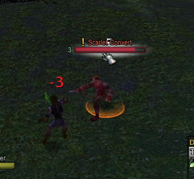

# QuestPlates

**Quest objective indicators on nameplates for WoW Vanilla 1.12.1**

QuestPlates adds a golden **"!"** icon to the nameplates of mobs related to your active quests — just like modern WoW, but for Vanilla 1.12.1.

Works with **pfUI** nameplates and uses the **pfQuest** database to accurately resolve which mobs you need, even for item drop quests.




## Features

- Golden **"!"** icon on nameplates for quest objective mobs
- **Kill quests**: directly marks mobs you need to slay
- **Item drop quests**: uses pfQuest's database to find which mobs drop your quest items
- **Reference loot support**: resolves shared loot tables for accurate mob marking
- **Fallback parser**: also reads quest log objective text for compatibility
- **Lightweight**: minimal CPU usage with throttled updates (~5 FPS check cycle)
- **Auto-updates**: re-scans objectives on quest accept, turn-in, and progress

## Requirements

| Addon | Required | Link |
|-------|----------|------|
| **pfUI** | Yes | [github.com/shagu/pfUI](https://github.com/shagu/pfUI) |
| **pfQuest** | Yes | [github.com/shagu/pfQuest](https://github.com/shagu/pfQuest) |

## Installation

1. Download or clone this repo
2. Copy the `QuestPlates` folder into your `WoW/Interface/AddOns/` directory
3. Restart WoW or `/reload`

```
WoW/
  Interface/
    AddOns/
      QuestPlates/        <-- this folder
        QuestPlates.toc
        QuestPlates.lua
      pfUI/
      pfQuest/
```

## How it works

1. On quest log updates, QuestPlates scans all active incomplete quests
2. For each quest, it queries `pfDB` (pfQuest's database) to resolve:
   - **Unit objectives** (`obj["U"]`) — mobs to kill
   - **Item objectives** (`obj["I"]`) — items to collect, then finds mobs that drop them via `items[id]["U"]` and reference loot tables
3. Every 0.2 seconds, it checks all visible pfUI nameplates and shows/hides the "!" icon based on the mob's name

## Compatibility

- **Client**: WoW 1.12.1 (build 5875)
- **Nameplates**: pfUI built-in nameplates (`pfNamePlate` frames)
- **Database**: pfQuest database (`pfDB.quests`, `pfDB.items`, `pfDB.units`)
- **Servers**: Works on any Vanilla private server

## FAQ

**Q: The "!" doesn't show on some quest mobs?**
A: Make sure pfQuest is loaded and has data for that quest. QuestPlates depends on pfQuest's database to resolve mob names.

**Q: Does it work with ShaguPlates or other nameplate addons?**
A: Currently only pfUI nameplates are supported. ShaguPlates uses a different frame structure.

**Q: Can I change the icon size or color?**
A: Edit `QuestPlates.lua` — look for the `SetFont` line (size) and `SetTextColor` line (color).

## License

MIT
